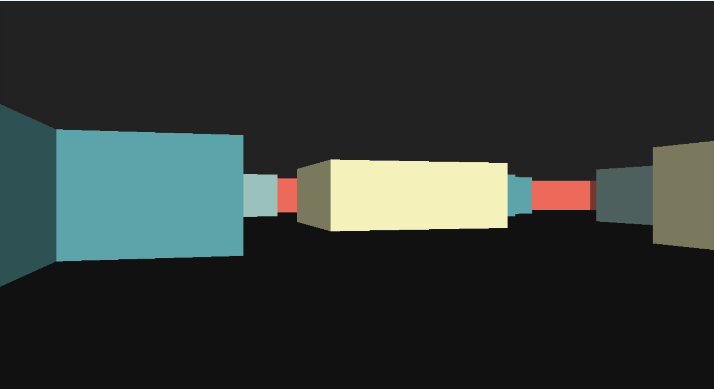

# Raycasting Engine 

A lightweight, high performance pseudo 3D engine built entirely in C and SDL2, inspired by the 90s classics like Wolfenstein 3D.

## Why this Engine?
I built this project to explore the intersection of trigonometry and low level rendering. Instead of relying on modern 3D APIs like OpenGL or DirectX, this engine calculates every single vertical line of pixels using the **DDA (Digital Differential Analyzer)** algorithm.

## Features
* **Fast DDA Algorithm:** Optimized ray to wall intersection logic.
* **Delta-Time Movement:** Smooth, frame rate independent player physics runs perfectly on any hardware.
* **Retro Aesthetics:** Custom wall shading and floor/ceiling gradients.
* **Portable:** Compiles into a single, standalone static executable for Windows.

## How to Use
The engine is focused on smooth movement and exploration.

| Action | Control |
| :--- | :--- |
| **Move Forward/Back** | `W` / `S` |
| **Rotate Camera** | `A` / `D` |

---

## Build Instructions
This project uses an optimized `Makefile` with object file caching for fast compilation.

### Prerequisites
* **Windows:** Install [MSYS2 (MinGW-64)](https://www.msys2.org/) and the `mingw-w64-x86_64-SDL2` package.

### 1. Development (Debug Mode)
Includes debug symbols and fast compilation.
* `mingw32-make debug`

### 2. Distribution (Release Mode)
Optimizes for speed (`-O2`), strips unnecessary data, and bakes all libraries into the `.exe` so it runs on any PC without SDL2 installed.
* `mingw32-make release`

## License
Licensed under the **MIT License**. Feel free to fork it, break it, or build the next retro hit with it!